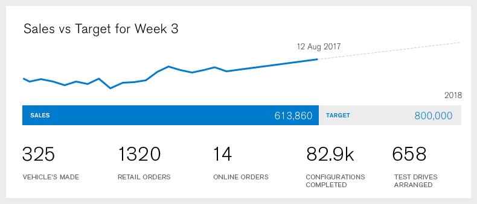

Dashboard
=============

The Brief
-------

Dashboard is a data visualisation platform created for internal use within a car manufacturing company.

Instructions
-------

Do your best to recreate the design found within `assets/design.psd`, utilizing HTML5, CSS3 and JavaScript as you see fit.

When complete, please fill out and attach `src/README.md` and return your zipped source folder to the recruiter.

Requirements
-------

1. You should use [React](https://facebook.github.io/react/) as the view layer.

2. You are encouraged to use [D3](https://d3js.org/) for the chart.

Considerations
-------

#### Design

Your completed page should match the design as closely as possible

#### Data

You may use the mock data provided in `assets/mock-data.json`, or create your own for the line graph.

#### JavaScript

Ensure to write clean, structured JavaScript that you feel would be suitable for a live website. Usage of ES6 is encouraged.

#### React

Ensure you break the UI into a sensible component hierarchy and can show an understanding of composition over inheritance.

#### Tests

Unit tests are not required, but showing an understanding of unit testing is encouraged.

#### Build Tools

You may use build tools such as [Webpack](https://webpack.github.io/), [Rollup](https://github.com/rollup/rollup) and  [Gulp](http://gulpjs.com/) to compile, minify, or other common tasks.  If minifying your code, please ensure to also include the source files for inspection.

#### Standards Compliance

Ensure that your markup is W3C compliant.

#### HTML Semantics

Ensure that your markup is semantic.

#### CSS

Usage of CSS modules or a CSS preprocessor is encouraged.

#### Browser Support

The page should function in the latest version of [Google Chrome](https://www.google.com/chrome/).
